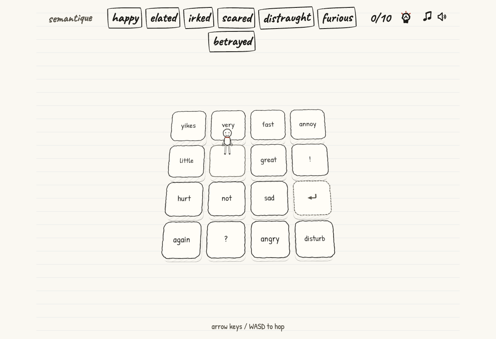

# Semantique 🐇

**Welcome to Semantique** a short adventure game where you test your prompting chops. 

Hop around constructing prompts and see if you can tease out all the target words from **MiniCPM3-4B**. But be careful! Your context window can only stretch so far...

▶ **[Watch the demo](https://youtu.be/bnMM3cq900w)** · 📣 **[Read the LinkedIn post](https://www.linkedin.com/posts/ben-blaker-085108175_semantique-a-masochistic-adventure-game-activity-7472415885388070912-YruU)** · 📝 **[Lessons Learned](https://benjosaur.substack.com/p/859bbc88-1be8-4070-ba06-cc3b29b80966)**

Keep an eye out for Easter eggs to find on your adventure.

## Technical Stuff

Once constructed, prompts are sent to an open source implementation of **structured outputs**, hosted on Modal. The system prompt names the board's targets and asks for the one most similar to your sentence. A single forward pass then scores how likely each candidate label is as the answer. The next-token distribution is masked to the board's labels and softmax-renormalized. The constrained decoding is then made visible as the verdict card's probability bars.

Built for the **Build Small Hackathon**.

## AI Disclaimer
- All tilesets were handcrafted by me including the core idea for the game and adventure.
- High level art style direction given by me however all implementation assets generated by Fable 5/Opus 4.8 (exception of background music: Cipher — **Kevin MacLeod**; Corporate Glitch — [Dmitrii Kolesnikov](https://pixabay.com/users/the_mountain-3616498/?utm_source=link-attribution&utm_medium=referral&utm_campaign=music&utm_content=171582); Sweet Country Farm Music Full — [catch22music](https://pixabay.com/users/catch22music-43977658/?utm_source=link-attribution&utm_medium=referral&utm_campaign=music&utm_content=354815))